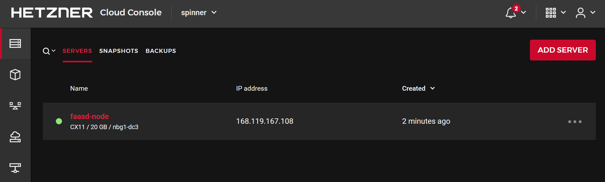
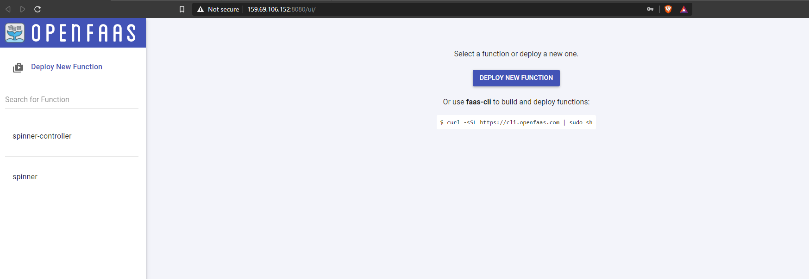

# spinner ⚡🔄


## Introduction

Serverless functions built with [OpenFaaS](https://www.openfaas.com/) to spin new servers on Hetzner Cloud and shut them down automatically when they are unutilized.

## Use-cases

- Scaling nodes horizontally for video-encoding based on incoming HTTP requests.

## Benefits

- Saving costs for large and expensive servers in Hetzner Cloud provider.

## Prerequisites

- Docker
- [faas-cli](https://github.com/openfaas/faas-cli)
- Terraform

## Provision infrastructure

As of today, the cheapest server type on Hetzner Cloud is `cx11` (1vCPU, 2GB RAM for 3EUR/month). Learn more about the wide range of server types [here](https://www.hetzner.com/cloud).

Let's provision a `cx11` server with `faasd` installed. We'll be using [cloud-init](https://cloudinit.readthedocs.io/en/latest/) to initialize the server with `faasd`, as per the [cloud-config.tpl](cloud-config.tpl) file.

## Overview

To make it easier to provide all prerequisites like the OpenFaaS and Terraform command line utilities, we provide a container image and use it for bootstrapping now.

```cli
docker run --rm -it \
  -e TF_VAR_hcloud_token=<HCLOUD_TOKEN> \
  -v ~/.ssh:/root/.ssh \
  felipecruz/spinner-infra-boostrap
```

- The `-e TF_VAR_hcloud_token=<HCLOUD_TOKEN>` env. var is required to authenticate to Hetzner Cloud and provision the infrastructure.
- The `-v ~/.ssh:/root/.ssh` parameter is required to configure the Hetzner server with your SSH key so that you can SSH into it if needed.

Or you could build and run it yourself:

```cli
# Build the bootstrap container
docker build -t spinner-infra-boostrap .

# Exec into the bootstrap container
docker run --rm -it \
  -e TF_VAR_hcloud_token=<HCLOUD_TOKEN> \
  -v ~/.ssh:/root/.ssh \
  spinner-infra-boostrap
```

## Bootstrap the infrastructure

```cli
# Initialize Terraform
/work # terraform init
# Create the infrastructure in Hetzner Cloud
/work # terraform apply -auto-approve
```

If everything went well, you should see the following output:

```
gateway_url = http://<faasd-node-ip>:8080
login_cmd = faas-cli login -g http://<faasd-node-ip>:8080 -p <random-password>
password = <random-password>
```

The server should have been created with `faasd` installed.



Give `faasd` a few minutes to startup as the server will be initializing with the cloud-init configuration right after it has booted. If needed, you could SSH into the server and check the status of the `faasd` service. It should say `active (running).

```cli
ssh root@$FAASD_NODE_IP 'systemctl status faasd'

systemctl status faasd
● faasd.service - faasd
     Loaded: loaded (/lib/systemd/system/faasd.service; enabled; vendor preset: enabled)
     Active: active (running) since Mon 2020-12-28 15:14:15 CET; 12min ago
...
(ommited lines)
...
```

Then, access the OpenFaaS UI at http://$FAASD_NODE_IP:8080/ using the username `admin` and the random password generated previously.



As you can see in the picture above, there are two functions already deployed:

- The [spinner](spinner) function serves an endpoint to create a new server to process HTTP requests. It will serve the request by creating a new server of type `cx21` with image `Ubuntu 20.04` located on `nbg1` (Nuremberg) on Hetzner Cloud and will perform a `301 Redirect` to the caller. Replace the `X-Api-Key` value with your own.

```cli
curl -v \
 --header "X-Api-Key: <HCLOUD_TOKEN>" \
 http://$FAASD_NODE_IP:8080/function/spinner?server_type=cx21&image_name=ubuntu-20.04&location=nbg1
```

- The [spinner-controller](spinner-controller) function is triggered based on the cron expression defined in [spinner-controller.yml](spinner-controller.yml#L12) and is responsible for deleting any running servers that are not doing any work based on the [provided criteria](spinner-controller.yml#L18-L20).

For instance, if we want to delete any servers whose CPU load is below under 50% in the last 5 minutes, set the following values:

```yaml
metric_name: "cpu"
metric_threshold: "50"
last_minutes: 5
```

and deploy the spinner-controller function again:

```cli
faas-cli login -g http://<faasd-node-ip>:8080 -p <password>
faas-cli deploy -f spinner-controller.yml
```

Once deployed, it will be automatically called based on the cron schedule.

## Clean up

```cli
# Destroy the infrastructure in Hetzner Cloud
/work # terraform destroy -auto-approve
exit
```

## Troubleshooting

The cloud-init output log file (/var/log/cloud-init-output.log) captures console output so it is easy to debug your scripts following a launch if the instance does not behave the way you intended.

```
ssh root@<faasd-node-ip>
cat /var/log/cloud-init-output.log
```
